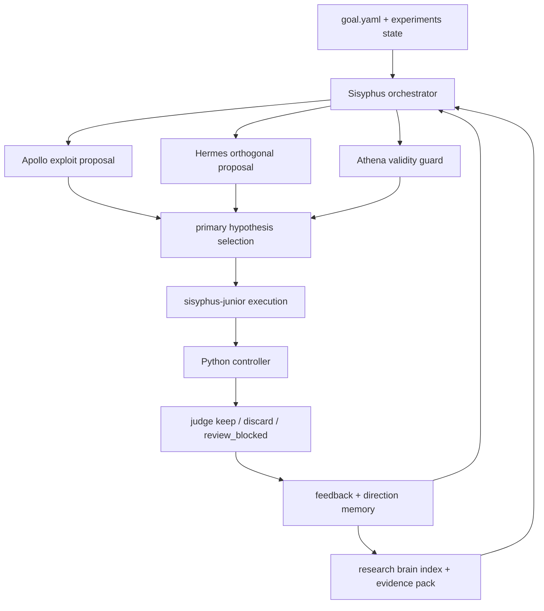

[English](./README.md) | [简体中文](./README.zh-CN.md)

# OpenCode Auto Research

OpenCode Auto Research 是一个面向 OpenCode + oh-my-opencode 的、本地优先（local-first）的受治理自动化实验与创新性科研大脑工程系统。

它的目标不是简单“自动跑实验”，而是把下面几条能力真正接进一个统一系统里：

- 自动 baseline / candidate / judge 实验循环
- 三专家提案机制（Apollo / Athena / Hermes）
- 本地论文库驱动的 research brain
- evidence pack 与 paper grounding
- keep / discard 后验反馈学习
- direction memory 与失败后改向

## 项目定位

这个项目当前最准确的定位是：

- 高质量研究工程原型
- controller-first 的自动化实验系统
- 本地 first 的创新性科研实验助理

## 核心能力

- Python controller 作为唯一 outer-loop authority path
- `Sisyphus` 作为唯一外层编排器
- `sisyphus-junior` 作为唯一代码执行者
- `Apollo / Athena / Hermes` 作为 exploit / validity / orthogonal 三专家
- `experiments/` 作为真相源工件目录
- `scripts/kb/` 作为 research brain 维护与推理链

## 架构图



## 主路径说明

- `scripts/innovation_loop.py` 是唯一外层 authority path
- TypeScript legacy orchestration 仅保留 internal/test-only 兼容语义
- 真实状态以 `experiments/` 下的结构化工件为准，而不是 prompt 临时上下文

## 目录结构

```text
opencode-auto-research/
├── .opencode/                  # 命令、技能、agent 文档
├── configs/                    # 目标与 research brain 配置
├── dist/                       # 构建产物
├── experiments/                # 真相源工件与运行结果
├── fixtures/                   # 测试 fixture
├── scripts/                    # Python controller / research brain / docker smoke
├── src/                        # TypeScript 插件、agents、tools、bridge
├── tests/                      # 单测、集成、E2E
├── AGENTS.md                   # 项目路由规则
├── README.md
├── README.zh-CN.md
├── INSTALL.md
├── GUIDE.md
└── REMOTE_EXECUTION.md
```

## 安装方式

### 最简单安装

```bash
git clone <your-repo-url>
cd opencode-auto-research
bash scripts/install-local.sh
```

这个脚本会：

- 安装 JS 依赖
- 安装 Python controller 依赖
- 检查 OpenCode / oh-my-opencode 是否存在
- 跑 build / test / smoke 验证

### 手动安装

```bash
npm ci
python3 -m pip install "dvc>=3,<4" "dvclive>=3,<4"
npm install -g opencode-ai oh-my-opencode
cp .env.example .env
```

然后填写：

- `KIMI_CODING_API_KEY`
- `KIMI_CODING_BASE_URL`
- 如需覆盖模型，可设置 `INNOVATION_LOOP_AGENT_MODEL`

## 使用方法

### 构建

```bash
npm run build
```

### 运行全部测试

```bash
npm test
```

### 运行 smoke

```bash
npm run test:smoke
```

### Python controller（mock）

```bash
python3 scripts/innovation_loop.py bootstrap --config configs/goal.yaml --workspace . --mode mock
python3 scripts/innovation_loop.py tick --config configs/goal.yaml --workspace . --mode mock
python3 scripts/innovation_loop.py status --config configs/goal.yaml --workspace . --mode mock
```

### OpenCode 命令

- `/innovate-loop`
- `/experiment-init`
- `/experiment-run`
- `/experiment-status`
- `/experiment-bootstrap`
- `/research-context`

## 预期效果

这套系统的预期效果不是替代研究员，而是成为一个创新性自动化科研实验助理：

- 更快迭代实验
- 用本地论文库给 proposal 做 grounding
- 在实验失败后自动改向
- 把 keep / discard 经验沉淀进 direction memory
- 把实验循环、知识脑、三专家、反馈学习接成闭环

## 如何在 OpenCode / oh-my-opencode 更新后保持稳定

核心策略：

1. 始终把 Python controller 当作唯一 authority path
2. TypeScript 层只做 bridge / adapter，不再承担第二控制面
3. 每次升级 OpenCode 或 oh-my-opencode 后，固定运行：

```bash
npm run build
npm test
npm run test:smoke
```

如果你本机有真实 DVC，再额外运行：

```bash
npm test -- tests/e2e/python-controller-real-dvc.test.ts
```

这样能最快判断升级是否破坏 controller path、research brain 或 remote contract。

## 远端执行说明

远端执行不是第二个 controller，而是现有 Python controller 的后端执行方式。

- 外环 authority path 不变
- stage command 可以包裹远端执行
- 但 metrics / checkpoint / `--resume-from` 的 contract 必须保持稳定

详见：`REMOTE_EXECUTION.md`

## 文档建议阅读顺序

1. `README.md` / `README.zh-CN.md`
2. `INSTALL.md`
3. `GUIDE.md`
4. `AGENTS.md`
5. `REMOTE_EXECUTION.md`

## 当前版本说明

1.0 版本意味着：

- 主控制面已收敛
- research brain 已稳定接入主链
- 公开工程仓库与主仓库都已过 build + test + smoke 验证
- 这是一个可以长期维护和继续迭代的稳定起点
